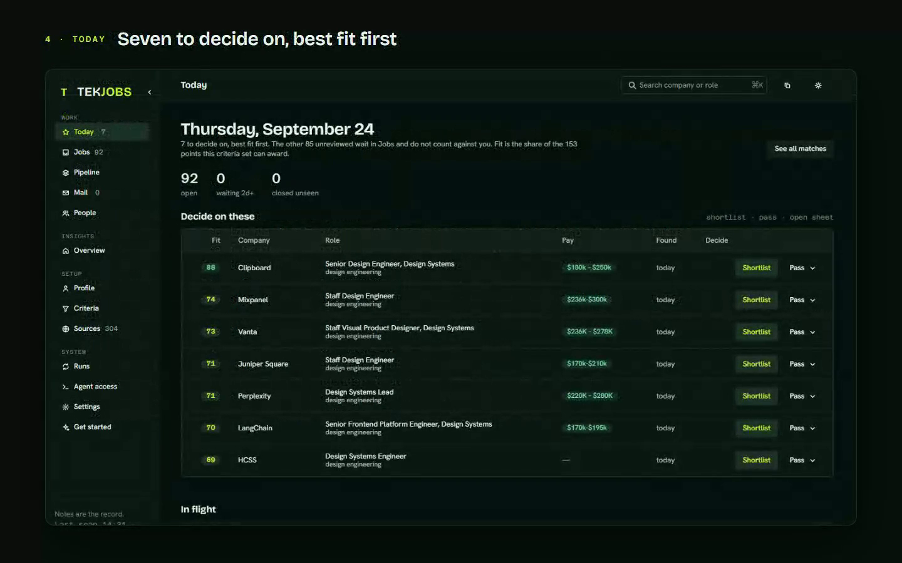

# TekJobs


[](https://www.npmjs.com/package/@timurtekb/tekjobs)
[](https://github.com/Timurtek/tekjobs/releases)
[](https://github.com/Timurtek/tekjobs/actions/workflows/release.yml)
[](package.json)
[](LICENSE)

A local career memory for you and your AI. TekJobs scans hundreds of public company job boards every morning, scores each posting against criteria you control, and saves the results as readable markdown files on your machine. Connect it to Claude Code, Codex, Cursor or Claude Desktop over MCP and your agent can weigh roles, prepare truthful application material and track the search, without ever making the final submission.

[Website](https://tekjobs.timurtek.com) · [Getting started](https://tekjobs.timurtek.com/docs/getting-started) · [Connect your AI client](https://tekjobs.timurtek.com/docs/ai-clients) · [npm](https://www.npmjs.com/package/@timurtekb/tekjobs) · [Releases](https://github.com/Timurtek/tekjobs/releases)

[](https://tekjobs.timurtek.com/#demo)

*Fifty-seven seconds, recorded from one real run on the fictional sample resume: install, interview, first scan, first Today. [Watch it on the site.](https://tekjobs.timurtek.com/#demo)*

## Why it exists

Most job-search products keep what they learn about your search inside their platform. TekJobs keeps it with you. Your resume, preferences, decisions, job notes, application history and drafts form a record on your own disk that gets more useful the longer you search, and you can change models, editors and AI clients without rebuilding it from zero.

## Who it is for

It fits if you apply across more than one kind of role and want criteria you can read and change; if you want to know why a job was recommended, point by point; if you already use Claude Code, Codex, Cursor or another MCP client and want it working from your notes; if you keep career notes in Markdown or Obsidian, or would like to; and if you want help with applications without anything being submitted for you.

It does not fit if you want a hosted service with nothing to install (TekJobs is a command and a folder), if you want one-click applications sent on your behalf (it stops before send, on purpose), or if you do not want any AI provider to see your resume (the scan and the notes never leave your machine, but the interview and the drafting send what you choose to the model you connect).

## What it does

- **A profile folder** (default `~/.tekjobs/profile`): your profile, your resume as text, the scoring criteria, the board watchlist, one note per matched job, your application history, and scan logs. Plain markdown, readable in Obsidian or anything else.
- **A daily scan** over Greenhouse, Lever, Ashby, Workday, Rippling, SmartRecruiters, Workable, BambooHR, Breezy, Personio, Teamtailor and Eightfold boards, the Atlassian, GitHub, Spotify and Amazon career APIs, the Google and Apple career pages (keyword-searched; they have no API), and eleven aggregator feeds including Wellfound's and Built In's remote listing pages. All public; the company-board scan needs no API key. Two optional feeds need a free key of their own: Adzuna, which reaches listings that never make it to a company board, and USAJOBS, which is every federal posting in the United States. Job alert emails saved into `Inbox/` are read too, which is how LinkedIn and Indeed listings get in without anything contacting those sites. Tens of thousands of postings a run, deduplicated, scored with every point written down as a reason, and cut to the ones that fit you.
- **An app** (Zengin UI): a Today queue, a filterable jobs table with a detail sheet, a drag-and-drop pipeline from reviewing to offer, a Sources page with each board's health and a retry for the failed ones, a criteria editor with a live preview of what a change would do, scan history with a run button, the profile pages, and the agent setup page.
- **Application material** written from your resume of record and checked against it: a tailored resume, a cover letter in your voice, and a copy panel for the answers forms keep asking for. Nothing is ever submitted; you review and click.
- **An MCP server** with 44 tools, so Claude Code, Codex, Cursor or Claude Desktop can run the whole search: onboard you, find matches, move them through the pipeline, pull your profile and a posting together to tailor an application, save the draft into the note, add boards, start scans, read the mailbox.

## Quick start

1. Create your search. The folder can be anywhere; inside an Obsidian vault is the nicest place.

   ```
   npx @timurtekb/tekjobs init ~/Obsidian/JobSearch --resume ~/Downloads/resume.pdf
   ```

2. Install the command, so the morning task has a home that lasts (npx's cache does not).

   ```
   npm install -g @timurtekb/tekjobs
   ```

3. Connect your AI client. Claude Code is one line; [Codex, Cursor and Claude Desktop](https://tekjobs.timurtek.com/docs/ai-clients) each take the same command, `tekjobs mcp`.

   ```
   claude mcp add tekjobs -- tekjobs mcp
   ```

   Then say:

   > Use the tekjobs MCP server. Call onboarding_status, then onboarding_materials, and follow its script: interview me, write my profile, set the criteria, run a dry scan, and show me the top matches.

   The interview reads your resume, asks the few things a resume cannot say (target titles, seniority, work mode, pay floor, hard exclusions, links), writes `Profile/Profile.md` and the criteria, and runs the first scan. LinkedIn: give it your LinkedIn data export, not a URL; it will not scrape profile pages.

4. Run the app, and schedule the mornings.

   ```
   tekjobs serve        # the app on http://127.0.0.1:8787
   tekjobs schedule     # the scan and the read-only mail pass, daily at 07:30 (--time to change it)
   ```

About twenty-five minutes end to end on a fresh machine, most of it the interview. To change the code, or to run the app from source, clone instead: `git clone https://github.com/Timurtek/tekjobs && cd tekjobs && npm install`, then `npm run init -- --resume <file>`; the app is `cd app && npm install && npm run dev` with `npm run server` beside it. The clone's `app/.mcp.json` connects the server for Claude Code on its own.

## Try it without your own data

`samples/vault` is a complete, fictional profile folder: Jordan Example, a design engineer three weeks into a search, with fourteen postings at companies that do not exist, one application in interview, a rejection, two passes, a closed listing, three people on the threads, two scan logs and the dashboard. Every note in it was written by the product's own code (`npm run sample` rebuilds it with today's dates), so it is always in the shape the app expects.

```
TEKJOBS_PROFILE=$PWD/samples/vault npm run serve
cd app && npm run dev
```

Point the API at it and the app shows a search in progress instead of an empty folder. Nothing in it is a real person, company or posting.

## Bring your LinkedIn history

LinkedIn will give you everything it holds about you as a zip. Request the **larger archive** at [linkedin.com/mypreferences/d/download-my-data](https://www.linkedin.com/mypreferences/d/download-my-data) (the smaller one has no connections or messages); a partial arrives by email in about ten minutes and the complete one within a day. Then:

```
tekjobs import linkedin ~/Downloads/Complete_LinkedInDataExport_2026-09-24.zip
```

The archive is read in place and never copied. Into your profile folder, and nowhere else, go: an index of who you know at which company, so every job note and the Jobs sheet show your connections there, recruiters first; People notes for the recruiters and hiring managers who wrote to you since a date (90 days by default, `--since` to change), with the thread as their log and a link to any open job note at that company; and your saved application answers into the copy panel. Applications and saved jobs are indexed for what comes next. Ads, reactions, searches, phone numbers and birth date are never opened. Re-running is safe. `--preview` shows the numbers first; over MCP the same is `import_linkedin` and `connections_at`. [The docs page](https://tekjobs.timurtek.com/docs/linkedin-import) has the walk-through.

## What local-first means

TekJobs keeps your profile, criteria, job notes, decisions and application history in files on your machine. It has no account and keeps no hosted copy of those records. There is no telemetry.

Two kinds of request do leave: the scan's reads of public job boards, and whatever context you choose to send to the AI provider you connect, which processes it under that provider's terms. Optional sources (Adzuna, USAJOBS) call their APIs with your key. Your files remain the durable record whichever model you use.

## Requirements

- **Node 20 or newer.** The scan has one dependency (PDF reading); the app ships built.
- **A folder for your profile.** Plain markdown. Obsidian is the nicest way to read it, and not required.
- **An AI client that speaks MCP, signed in on this machine.** Claude Code by default; Codex, Cursor and Claude Desktop work the same way. The interview and everything an agent does over MCP run there. The app's "Write cover letter" and "Tailor resume" buttons run a CLI with the prompt as an argument and read its output; the default is `claude -p --output-format text`, and another command goes under `"llm"` in `~/.tekjobs/config.json` or on the Settings page. No separate model API key: TekJobs adds no per-call AI billing, and usage follows the client you already have.
- **"Check mail" needs Claude Code specifically**, with its Gmail connector enabled. The run allows exactly three Gmail read tools by name and denies every write and shell tool, which is what makes it safe to run unattended; another CLI would need a Gmail MCP with matching tool names. Everything else works without it.
- Optional: free Adzuna and USAJOBS keys for those two feeds, and `"contact"` in `~/.tekjobs/config.json` so the user agent on scan requests names a way to reach you.

Nothing personal lives in this repository. Your profile folder (profile, resume, criteria, watchlist, job notes, logs, mail state) and `~/.tekjobs/config.json` are outside it; the repository is the code and the starter notes a new profile folder begins with.

## Known limitations

- **LinkedIn and Indeed are not scanned.** Their listings arrive through job-alert emails saved into `Inbox/`, or through a link you paste. Indeed blocks signed-out reads, so paste the company's own link instead.
- **Check mail is Claude Code only**, because it depends on that client's Gmail connector and on denying its tools by name.
- **Boards go quiet.** Company boards move platforms, rename slugs and rate-limit. The Sources page shows each board's health and retries the failed ones, and the registry is a table anyone can fix.
- **The app has no login.** It serves on 127.0.0.1 and is meant for one person on one machine. Do not expose the port to a network.
- **Pay parsing reads posted ranges.** A posting that hides its pay scores lower rather than being guessed at, which is the point, and also means some good roles rank below a candid one.
- **One person has run it in anger so far.** The onboarding has been rehearsed on the fictional sample resume and on a clean clone; the first report from another machine is welcome as an issue.

## Roadmap

- **Now**: the npm package, employer postings that enter the same scan, board health on the Sources page, a live preview when criteria change, the profile summary.
- **Next**: a short recorded demo of install, interview and the first Today; a LinkedIn data-export import into People; criteria presets per role that ship with the repository.
- **Later**: a command palette in the app, a desktop shell, and mail for clients other than Claude Code once they carry a Gmail connector with read-only tools.

## Cover letters

Each job has a Cover letter tab. "Write cover letter" runs a local LLM CLI you are already signed in to (Claude Code by default; set another under `"llm"` in `~/.tekjobs/config.json`), so there is no API key and nothing metered. It writes from the live posting and your resume, and your resume is the only source of facts. How it sounds comes from `Profile/Voice.md` in your profile folder: your voice rules, the shape of a letter you would send, the patterns you never use, and samples of your own prose. Edit that note to change every letter after it; there is a generic fallback for a profile without one. The prompt makes the model draft and then edit against the same checklist (portability test, repeated shapes, self-adjectives, quote count). The result is saved under `## Cover letter` in the job note and checked: a figure that is not on your resume, your profile or the posting is flagged, along with dashes, placeholders, stock phrases, a letter that never names the company, and the tells of a generated letter: a "decade" opener, "You ask for X" stanzas, tag lines, "not X but Y" contrasts, colon reveals, applicant boilerplate, adjectives about yourself. An agent connected over MCP can do the same with `cover_letter_materials` and `save_cover_letter`. If the CLI is signed out or out of date the tab says so and what to run.

## Tailored resumes

Each job also has a Resume tab. "Tailor my resume to this posting" produces a version of your resume of record with the summary rewritten for the posting and the bullets, capabilities and products reordered and pruned to what it asks for. It may not add anything: the check traces every bullet back to a line of your real resume and flags any bullet, figure, date range or job header that is not there. The result is saved under `## Tailored resume` in the job note (headings nested, restored on read) and the print view at `/api/jobs/<id>/resume.html` is where the PDF you upload comes from: print, save as PDF, margins and page size are set. Over MCP: `tailored_resume_materials` and `save_tailored_resume`.

## Adding a job you found yourself

The scan watches boards. For the posting you saw on LinkedIn, in a newsletter, or in a friend's message, paste the link: the "Add by link" button in the Jobs view, `tekjobs add <url> [<url>...]` on the command line, or the `add_job` MCP tool. Each link is read once, turned into the same job shape the scan produces, scored with your criteria, and written as a note unless the scan already has it, a note already points at that link, or an existing note has the same company and title. A Greenhouse, Lever or Ashby link is read through the board's API, so the note is as full as a scanned one; a Google or Apple job page is read by the same parsers the scan uses on those sites; any other page is read through its JSON-LD posting data when it has some, and its best title (not a "Job details" label), site name and text when it does not. A LinkedIn job link is opened once as a signed-out visitor, the way a browser would open it, and when the posting names the company's own apply page on one of those boards, that page is imported instead and the LinkedIn link is kept as where it was seen. Nothing searches or crawls: one link in, one request or two out. Indeed blocks signed-out reads; paste the company's own link instead. A note that has no posting (created from an email, say) takes one later through the job sheet's Attach posting: **Attach** reads the posting and replaces the note's facts and score, **Link only** records just the link, for a page that cannot be read or when the note is already right; either way Open posting then goes somewhere real.

## What the mailbox says

Applications come back as email: a confirmation, a rejection, an interview request. "Check mail" on Today reads those through the same local CLI that writes the letters, using the Gmail connector already attached to it, and with the run boxed: only the Gmail read tools are allowed and every write tool is denied by name, so a run can read and nothing else. The model only extracts (company, role, kind, date, one-line gist, message id); matching each email to a note and everything that changes a note is ordinary code, and nothing changes until you confirm an item. A confirmation on a note you had not marked applied marks it applied as of the mail's date; a rejection marks it rejected; an interview request marks it interviewing; an email about a job with no note offers to create one. Every confirmed item writes a dated line with the gist and a link to the message into the note, and fills the packet's Applied on when it is empty, which is what makes the response numbers on Overview real. Also `tekjobs mail [--days N]`, and `mail_check` / `mail_items` over MCP (read and start only; confirming is yours). The daily task runs the read right after the morning scan (`run.cmd`), and the envelope in the top bar shows how many email groups wait on you from any page, with a Check now for between-times.

## People

The recruiters, hiring managers, interviewers and referrals a search meets: one note each under `People/` (role, company, email, links, a line of context, the job notes they are on, a dated log of contacts), and a `## People` section on each job note naming who is on that thread. Most arrive from the mail check: when the email a person confirms was written by a human rather than a no-reply address, that human is added, put on the note, and gets the email on their log. The rest are added on the People page or from a job sheet's People tab. Nothing is enriched or looked up anywhere; the record is who actually wrote to you and who you actually met. Over MCP: `list_people`, `get_person`, `add_person`, `attach_person`, `log_contact`.

## The copy panel

Application forms ask for the same dozen things. The clipboard icon in the top bar opens a panel of one-click snippets: name, email, phone, location, links, availability, the salary answer, and anything you add (a work-authorization line, a standard "why this role" opener, a multi-line blurb). Type a few letters and Enter copies the first match. The list is yours: Customize edits labels, groups, values and order, and it is stored in `Profile/Snippets.md` as a json block, so Obsidian can edit it too. Until you save once, the panel offers a set read from your profile's Basics. Over MCP, `list_snippets` gives an agent the same answers verbatim.

## Applying

TekJobs never submits an application. The agent tailors the resume and cover letter from the note, prefills what it can, and stops. You review and click. Every field it drafts is written into the job note so the record survives.

## How scoring works

Everything is in the criteria JSON block in `Targets/Search Criteria.md`, which the interview writes and you can edit: title terms (weighted), hard exclusions, description keywords, seniority, remote rule, a pay floor with a stretch band beneath it, recency, and which aggregator feeds are on. A posting needs `minScore` to become a note. Notes are never rewritten once they exist; only their `listing:` line flips to closed when a posting disappears. Your `status:` edits are the record.

The app's **Criteria** page edits the same JSON as fields (bar, penalties, title and description terms, seniority words, location and pay rules, recency, source toggles) with the raw JSON one tab over; keys the form does not know about are kept. **Presets** are named criteria sets under `Targets/Criteria/`: save the current form as one, load one to edit it, make one the active set, or run a single scan with it without touching the daily scan (`tekjobs scan --criteria "<name>"`, the Score with picker on Runs, or `run_scan` with `criteria` over MCP). Every run logs which set it scored with, and every note carries that set's weights fingerprint. After a criteria change, `tekjobs rescore --full --dry` shows what the existing notes would score under the new rules (rebuilt from each note, recency judged at the day it was found, description points kept where the note holds only part of the posting) and `--full` without `--dry` applies it: score, pay band, the match reasons, and a status-log line on every note that moved.

The **Profile** page edits the notes applications are written from: `Profile/Profile.md` (who you are), `Positioning.md` (how the story is told), `Voice.md` (how you write), each with an Edit and a Preview; the resume note is shown read-only because `tekjobs resume sync` replaces it. Above it, **resume variants**: every PDF, DOCX, Markdown or text file in the variants folder (`Templates/Resume` inside the profile folder unless Settings says otherwise), each one a click from being the resume of record, and offered by name in the packet's Resume variant field.

**Settings** (System) holds the few things kept outside the profile folder, in `~/.tekjobs/config.json`: the profile folder itself (a change takes effect on the next server start; `tekjobs init <dir>` starts a new one), the resume variants folder, the writing CLI's command and arguments, and the optional contact for scan requests.

## Commands

```
tekjobs init [dir] [--resume <file>]   create (or adopt) a profile folder and remember it
tekjobs resume <file>                  import or replace the resume (PDF, DOCX, Markdown, text)
tekjobs status                         what the onboarding still needs
tekjobs scan [--dry] [--min N] [--floor N] [--only <slug>] [--criteria <preset name | file>] [--retry-failed]
tekjobs add <url> [<url>...] [--dry]   add postings you found yourself
tekjobs mail [--days N]                the read-only mail pass
tekjobs rescore [--full] [--dry]       what existing notes score under the current criteria
tekjobs schedule [--time HH:MM] [--print]   the morning task, for Windows, macOS or Linux
tekjobs serve                          the app + API on http://127.0.0.1:8787
tekjobs mcp                            the MCP server on stdio
tekjobs --version
```

From a clone the same commands are `node cli.mjs <command>`. The profile folder is resolved from `TEKJOBS_PROFILE`, then `~/.tekjobs/config.json`, then `~/.tekjobs/profile`.

## Layout

```
cli.mjs                    tekjobs command
run.mjs                    the scan
scraper/config.mjs         profile folder resolution, the two config notes
scraper/profile.mjs        init, resume import, onboarding status, interview materials, save profile, fetch link
scraper/resume.mjs         PDF / DOCX / Markdown text extraction
scraper/sources.mjs        Greenhouse, Lever, Ashby, Workday, RemoteOK, HN
scraper/sources-extra.mjs  the other platforms, career APIs, aggregators
scraper/score.mjs          scoring and pay-range parsing
scraper/health.mjs         per-board health for the Sources page
scraper/vault.mjs          job notes, dedupe state, closed detection, log, dashboard
scraper/starter/           the notes a new profile folder starts with (including the board registry)
app/                       Zengin UI front end, API server, MCP server
site/                      tekjobs.timurtek.com: the landing page and docs (Next.js on Zengin UI, deployed from this folder on Vercel)
samples/vault/             the fictional profile folder
tools/                     board discovery scripts, the sample-vault builder, the counts the README and the site print
```

## Releases

The package on npm is [`@timurtekb/tekjobs`](https://www.npmjs.com/package/@timurtekb/tekjobs) (the bare name was too close to an existing package for npm's liking); every release that changes the scan, the CLI or the app is published there by the release workflow, and `npx @timurtekb/tekjobs` runs the latest. Versions come from the commit messages, by [semantic-release](https://semantic-release.gitbook.io/) on every push to `main` (`.github/workflows/release.yml`): tests, the app's type check and `zengin check` run first; then `feat:` commits make a minor release and `fix:` and `perf:` a patch. The project is at 0.x on purpose, so a `BREAKING CHANGE:` footer or a `!` after the type also bumps the minor (the `releaseRules` line in `release.config.cjs`); delete that line when 1.0 is earned and breaking changes become majors. The release bumps `package.json`, writes `CHANGELOG.md`, tags `vX.Y.Z`, publishes the notes on GitHub and publishes the package to npm through [Trusted Publishing](https://docs.npmjs.com/trusted-publishers), so no npm token exists anywhere; the repository variable `NPM_PUBLISH` switches that last step on. Commit messages are checked locally by commitlint through a husky hook (`npm install` at the root sets it up), in the [Conventional Commits](https://www.conventionalcommits.org/) shape: `type(scope): summary`, scope optional, and a prose body is welcome. The app's sidebar footer shows the running version.

## Contributing

The two things that compound are data files: the board registry (`scraper/starter/companies-table.md`, platform + slug per company) and, soon, criteria presets per role. Pull requests to either are the most useful contribution. [CONTRIBUTING.md](CONTRIBUTING.md) has the mechanics (three installs, the design-system check, the commit format); [SECURITY.md](SECURITY.md) says where to report a vulnerability, and what counts as one.

Built by [Timurtek](https://www.timurtek.com) for his own search first. MIT licensed.
